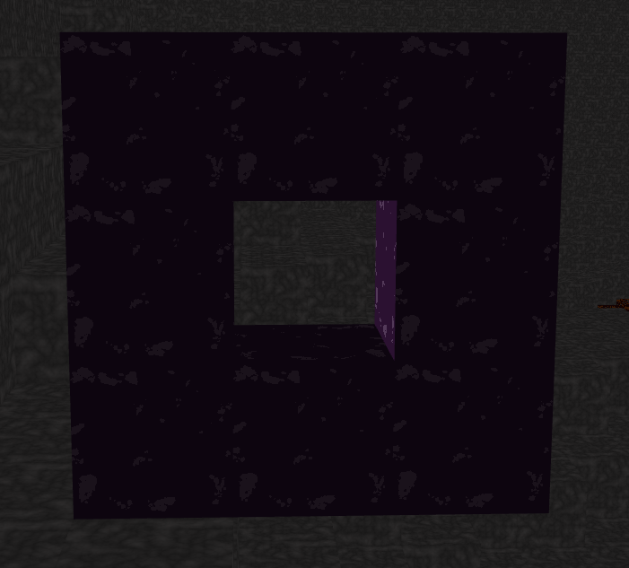
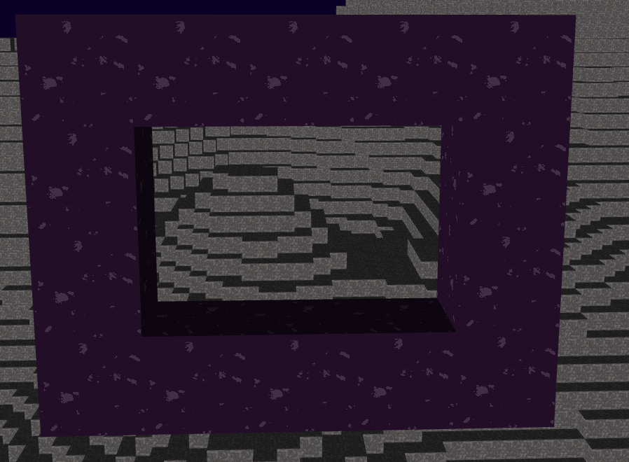
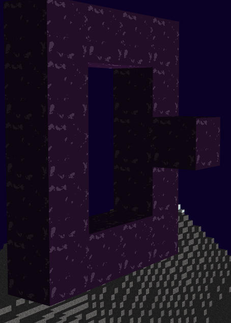
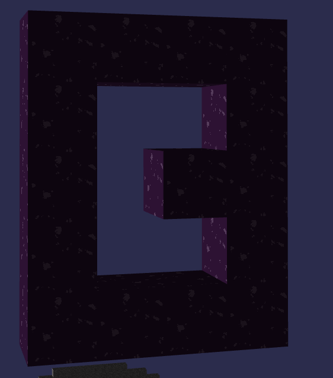
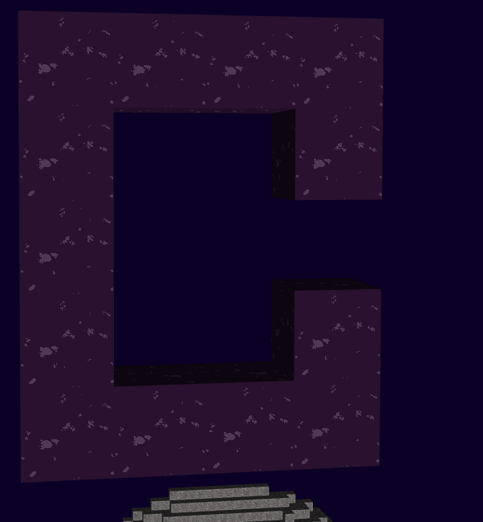

# Computer Graphics Final Project: Immersive Portals

In this project, Jeffrey Liu (jl72726) and Ian Trowbridge (it3434) modified the Minecraft Project to implement immersive portals for the  Computer Graphics Final Project.

### New Controls
- [X] Highlight Mode: Pressing 'h' allows the user to enter "highlight mode". This highlights empty spaces green when the player can place a block in said space. Occupied spaces are highlighted red, meaning the highlighted block must be removed before a block can be placed in that space.

- [X] Adding and Removing Blocks: Right-clicking the mouse will allow the player to add or remove blocks. Right-clicking an existing block will remove it and right-clicking an empty space will result in a block being placed in that location. Use the highlight mode to determine which cube the player has selected and whether a block will be added or removed when right-clicking.

- [X] Placing Normal Blocks: Pressing '1' will allow the users to place normal blocks. This is the default mode. Blocks will be removed as normal regardless of which block-placing mode the user is currently in.

- [X] Placing Portal Blocks: Pressing '2' will allow the users to place portal blocks. These blocks will be purple and exhibit time-dependent Perlin noise. Blocks will be removed as normal regardless of which block-placing mode the user is currently in.

- [X] Recursive Portals: Pressing the 'up' arrow key will increase the level of recursion, allowing for portals to recursively display the contents of other portals and create a "hall-of-mirrors" effect. Each press increases the level of recursion by 1. Pressing the 'down' arrow key will decrease the level of recursion by 1, causing fewer layers of recursion to be displayed.

### Features

- [X] Creating Portals: In order to create a portal, the player must first create a valid portal using portal blocks. Valid portals are comprised completely of portal blocks. These portal blocks must only form the edge of the portal, surrounding empty space. These portal blocks must also only fall on a flat plane. Portals can be placed in any orientation, and any desired number of portals can be placed. Two valid portals are required to create an active portal connection. Portal activation happens automatically and will connect the two most recently completed valid portals.

Two examples of **valid** portals are shown below. The portals are comprised only of portal blocks, surround empty space, and fall on a flat plane:

  
   

Three examples of **invalid** portals are shown below. The leftmost one has a portal block that does not lie on the plane the rest of the blocks are on. The middle picture has a portal block that does not fall on the edge of the portal. Finally, the rightmost structure is missing an edge block required to complete the portal.

  
   
   

- [X] Immersive Portal Views: Once portals are active, the inner space of the portal will display the view from the connected portal. This view is responsive to player movement. Moving closer or farther will result in the view zooming in or out respectively. Likewise, rotating the player will cause the portal view to rotate, and shifting the player left or right will cause the portal view to respond appropriately. Each portal has two sides, letting the player see the view from either direction of the connected portal.

- [X] Recursive Portals: As mentioned in the control section, recursive portal views have been implemented, allowing a hall-of-mirrors effect. If two connected portals have each other in their respective views, the player can increase the recursion level to see a cascade of portals appear.

- [X] Teleportation: Walking through a portal will result in teleportation to the connected portal. Walking through one side of the portal will teleport you to the appropriate side of the connected portal. Furthermore, if the portals are connected at a 90-degree angle with one another, the teleportation will automatically rotate the player so that they are facing the same direction as they saw through the portal.

### Work balance

- Jeffrey Liu implemented the rendering and shader code required to generate the portals, including the modifications to the portal's camera with respect to the player's movements. This includes the camera controls needed to create the illusion of a responsive portal and recursive portal generation.

- Ian Trowbridge worked on adding and removing blocks, highlighting blocks, and portal mechanics. This includes teleportation and the activation and deactivation of portals, as well as the portal mesh object.

### Extra Credit: Course Surveys

Ian Trowbridge completed the course survey for extra credit.
